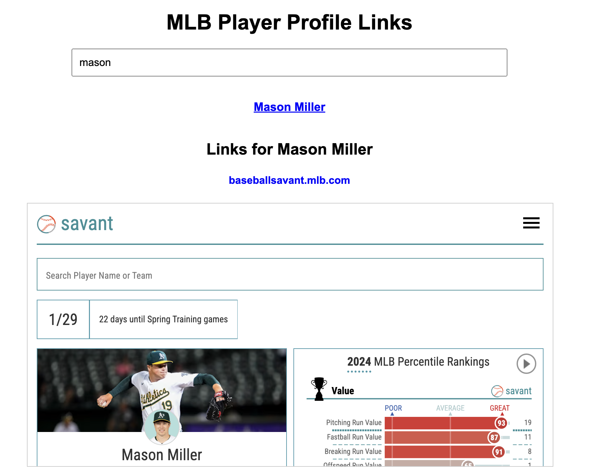

# DiabeticAthletes
A simple website, data, links and information for T1D athletes so that people can find them in one source

This is a work in progress.

Let me know if I am missing any T1D (only type 1, not type 2)

Anyone who wants to help is more than free to; just email me how you would like to help

## Please check these out for awareness and more information

https://www.breakthrought1d.org/

https://gis.cdc.gov/grasp/diabetes/diabetesatlas.html

https://github.com/jtb21091/HealthDataPublicDiabetes

# 🏆 Diabetic Athletes - Player Links

This project provides an easy-to-use **Player Profile Link Finder** that allows users to search for diabetic athletes and access their player profile links. The search bar helps you find players quickly, and each player has multiple links categorized by website.

---

## 🚀 How to Run This Locally (No Coding Required)

### **Option 1: Open Directly (Computer)**
1. **Download the project folder** (or clone it).
2. **Go to the `html` folder** inside the project.
3. **Double-click `index.html`** – It will open in your browser! 🎉

## Link and example

https://jtb21091.github.io/DiabeticAthletes/

